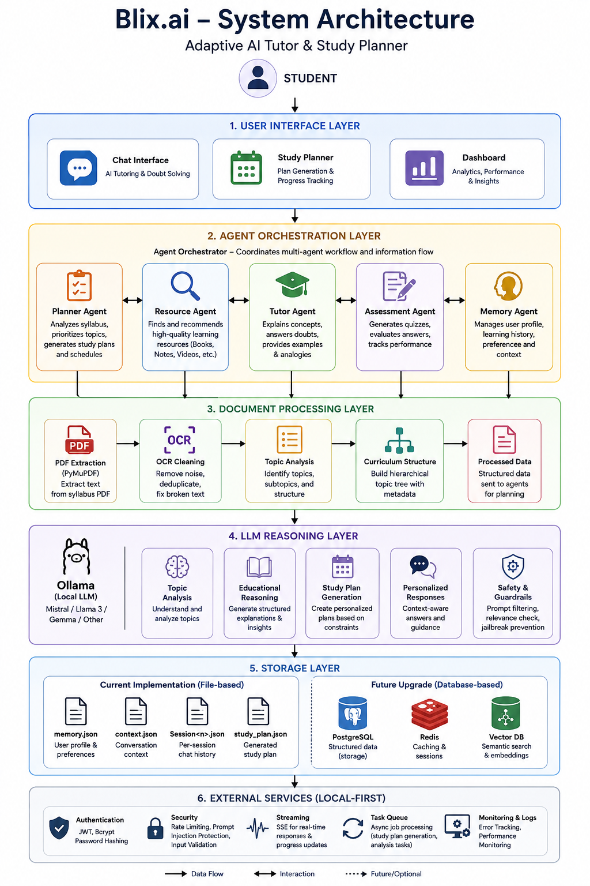

<div align="center">

# 🚀 Blix.ai

**Adaptive AI Tutor & Study Planner**

*Multi-user AI tutoring platform · PDF syllabus analyzer · LLM-powered study plans · Local-first*

[](https://nodejs.org)
[](https://python.org)
[](https://ollama.com)
[](https://expressjs.com)
[](https://fastapi.tiangolo.com)
[](#license)

</div>

---

## Overview

Blix.ai is a full-stack AI learning platform built on locally-hosted LLMs via [Ollama](https://ollama.com). It combines a production-grade multi-user AI tutoring backend with an automated study planner that reads your exam syllabus PDF and produces a weighted, day-by-day revision schedule.

The entire system runs on your own hardware — no external API keys, no data sent to third-party servers.

---

## Key Features

### Chat Platform
- **Multi-user AI tutoring platform** — isolated per-user state, sessions, and memory
- **JWT authentication & session management** — bcrypt hashing, login rate limiting, timing-safe comparison
- **Persistent user memory** — profile fields (`name`, `level`, `style`) survive restarts and inform every response
- **Context-aware conversations** — rolling summary layer keeps long-session coherence without unbounded token growth
- **Local LLM execution via Ollama** — Mistral, LLaMA 3, Gemma, or any compatible model; zero cloud dependency
- **Streaming AI responses** — SSE with per-chunk heartbeat and upstream abort propagation
- **Multi-mode tutoring system** — five distinct personas with separate system prompts and sampling configs
- **Response relevance guard** — keyword overlap filter rejects off-topic responses before they reach the client
- **Prompt injection hardening** — 14 regex patterns strip jailbreak attempts; static system layer is never truncated
- **Multiple named sessions** per user, auto-synced to disk every 10 s, flushed on graceful shutdown

### Study Planner
- **PDF syllabus analysis** — page-by-page extraction, OCR deduplication, structured topic tree output
- **Automated study plan generation** — difficulty-weighted scheduling with weak/strong subject modifiers
- **Async study planning jobs** — non-blocking `POST /plan` + `GET /plan/{job_id}` polling
- **SSE streaming** — `POST /plan/stream` pushes progress events to the browser in real time
- **Export formats** — JSON, Markdown, CSV from the analyzer

### Infrastructure
- **Circuit breaker per model** — CLOSED → OPEN → HALF_OPEN with race-safe probe gating
- **Split connect/read timeouts** — 10 s connect, 180 s generation, per-chunk silence timer
- **Stream → non-stream fallback** on Ollama version mismatch or mid-stream abort
- **Atomic file writes** (temp-file + rename) across all persistence layers
- **Schema versioning** with automatic migration on load
- **Graceful SIGTERM/SIGINT shutdown** — flushes all in-memory sessions before closing connections

---

## Architecture

<p align="center">
  
</p>

<p align="center">
  <em>Figure 1: High-level architecture of Blix.ai.</em>
</p>

```
Student
    │
    ▼
┌────────────────────────────────────────┐
│          Blix Chat Platform            │
│                                        │
│  ┌──────────────┐  ┌─────────────────┐ │
│  │ JWT Auth     │  │ Session Manager │ │
│  └──────────────┘  └─────────────────┘ │
│  ┌──────────────┐  ┌─────────────────┐ │
│  │ Memory Layer │  │ Context Layer   │ │
│  │ (profile +   │  │ (rolling conv.  │ │
│  │  interests)  │  │  summary)       │ │
│  └──────────────┘  └─────────────────┘ │
│  ┌──────────────┐                      │
│  │ Prompt Engine│  ← 5 tutor modes     │
│  └──────────────┘                      │
└──────────────────┬─────────────────────┘
                   │
                   ▼
          ┌─────────────────┐
          │  Local LLM      │
          │  (Ollama)       │
          │  mistral / any  │
          └────────┬────────┘
                   │
                   ▼
┌──────────────────────────────────────────┐
│         Study Planner Service            │
│                                          │
│  ┌──────────────┐  ┌───────────────────┐ │
│  │ PDF Extract  │  │  OCR Cleaning     │ │
│  │ (PyMuPDF)    │  │  (adv_cleaner)    │ │
│  └──────────────┘  └───────────────────┘ │
│  ┌──────────────┐  ┌───────────────────┐ │
│  │ Topic        │  │  Weighted         │ │
│  │ Analyzer     │  │  Scheduler        │ │
│  └──────────────┘  └───────────────────┘ │
│  ┌──────────────┐                        │
│  │ Plan         │  → JSON / SSE / CSV    │
│  │ Generator    │                        │
│  └──────────────┘                        │
└──────────────────────────────────────────┘
```

---

## Tutor Modes

Five distinct personas — auto-detected from message content or set explicitly via the `mode` field.

| Mode | Trigger | Behavior |
|---|---|---|
| **Default** | General questions | 150–300 word balanced explanations with analogies and examples |
| **Research** | Deep analysis requests | 400–800 word academic analysis — theory, tradeoffs, complexity, real-world use |
| **Code** | Code generation / debugging | Working code with inline comments, minimal prose; bug-first on debug tasks |
| **Canvas** | Visual / diagram requests | ASCII diagrams using box-drawing characters, trees, flowcharts, then explanation |
| **Flash** | Quick factual queries | 1–5 line answers, maximum density, zero filler |

---

## Study Planner Pipeline

```
input.pdf
    │
    ▼
PDF Extractor (PyMuPDF)
    │   page_num · text · word_count · reading_time_min
    ▼
AdvancedDataCleaner
    │   OCR dedup · broken word fix · camelCase split
    │   unicode strip · header frequency removal
    ▼
PageWiseAnalyzer  (async, concurrency=3)
    │   per-topic: name · difficulty · importance
    │             exam_frequency · estimated_hours
    │             subtopics · LLM confidence
    ▼
WeightedScheduler
    │   proportional hour allocation + weak/strong modifiers
    │   time_weight = difficulty×0.5 + subtopic_count×0.3 + importance×0.2
    │   weak_subjects → +25%  |  strong_subjects → −12%
    ▼
PlanGenerator (LLM)
    │   high_level_plan · detailed_schedule
    │   revision_strategy · optimization_notes
    ▼
study_plan.json / SSE stream / CSV / Markdown
```

---

## Storage Layer

Blix.ai uses **file-based persistence with atomic writes** (temp-file + rename). A crash mid-write never produces a corrupt file. Concurrent writes for the same user are serialized through a per-user FIFO lock.

Each user has three JSON files under `data/users/<idx>/`:

| File | Contents |
|---|---|
| `memory.json` | Profile (`name`, `level`, `style`), topic interests, interaction count |
| `context.json` | Rolling summary of recent conversations |
| `Session<n>.json` | Turn history for each named session |

`userState.js` coordinates writes to both `memory.json` and `context.json` under a single composite lock (`state:<userId>`). Write order is context-first (recoverable), memory-second (critical). If the memory write fails, the service restores the pre-update snapshot before re-throwing.

**Future migration targets:**
- PostgreSQL (user records + sessions)
- Redis (job store, session cache)
- Vector database (embedding-based context retrieval)

---

## Repository Structure

```
blix/
│
├── server.js                   # Express entry point
├── package.json
├── .env                        # ← copy from .env.example, add JWT_SECRET
├── Modelfile                   # Custom Ollama model definition for Blix
│
├── routes/
│   ├── auth.js                 # POST /auth/register, /auth/login, GET /auth/me
│   └── chat.js                 # POST /chat, /chat/stream · GET /chat/history
│
├── services/
│   ├── prompt.js               # Multi-mode prompt engine
│   ├── ollama.js               # Ollama client with circuit breaker
│   ├── memory.js               # Per-user profile persistence
│   ├── context.js              # Per-user session context
│   ├── auth.js                 # JWT, bcrypt, rate limiter
│   ├── userState.js            # Transactional memory + context updates
│   └── utils/
│       ├── lock.js             # FIFO async lock (shared)
│       ├── atomicWrite.js      # Temp-file atomic writes
│       ├── contextAdapter.js   # context → {role,content}[] adapter
│       ├── migrate.js          # Schema migration
│       └── user.js             # userId sanitization, path helpers
│
├── public/
│   ├── index.html              # Landing page
│   └── chat/
│       ├── index.html          # Main chat UI
│       └── auth.html           # Login / register
│
├── data/                       # Runtime data (git-ignored in production)
│   ├── users.json
│   └── users/<idx>/
│       ├── memory.json
│       ├── context.json
│       └── Session<n>.json
│
└── study/                      # Python study planner service
    ├── api_server.py           # FastAPI REST + SSE server
    ├── OllamaLLM.py            # Async Ollama client
    ├── PageWiseAnalyzer.py     # Async topic extractor
    ├── StudyPlannerBackend.py  # Pipeline orchestrator
    └── adv_data_cleaner.py     # OCR cleaning pipeline
```

---

## Prerequisites

| Dependency | Version | Notes |
|---|---|---|
| Node.js | ≥ 18 | For `fetch` without polyfill |
| npm | ≥ 9 | Bundled with Node |
| Python | ≥ 3.10 | For study planner |
| Ollama | latest | [ollama.com/download](https://ollama.com/download) |
| mistral | — | Or any model — see [Configuration](#configuration) |

---

## Installation

### 1. Clone and install

```bash
git clone https://github.com/SAYANDUTTA8442/blix.ai.git
cd blix.ai
npm install
```

### 2. Python dependencies (study planner)

```bash
pip install fastapi uvicorn aiohttp requests pydantic
pip install pymupdf          # PyMuPDF — primary extractor
pip install pdfplumber       # fallback for complex layouts
```

### 3. Pull the LLM

```bash
ollama pull mistral
```

Or build the custom Blix tutor persona:

```bash
ollama create blix -f Modelfile
# Then set OLLAMA_MODEL=blix in .env
```

### 4. Configure environment

```bash
cp .env.example .env
```

Open `.env` and set at minimum:

```env
JWT_SECRET=your-random-256-bit-secret-here
```

Generate a strong secret:

```bash
node -e "console.log(require('crypto').randomBytes(32).toString('hex'))"
```

---

## Running

### Start Ollama

```bash
ollama serve
```

### Start the Node.js backend

```bash
npm run dev   # development (auto-reload)
npm start     # production
```

Server starts on `http://localhost:3000` (or `PORT` from `.env`).

### Start the Python study planner API

```bash
cd study
uvicorn api_server:app --host 0.0.0.0 --port 8000 --reload
```

API docs available at `http://localhost:8000/docs`.

---

## Configuration

All settings are controlled via `.env`. Full reference:

```env
# ── Server ───────────────────────────────────────
PORT=3000
HOST=0.0.0.0
NODE_ENV=development          # development | production

# ── Auth ─────────────────────────────────────────
JWT_SECRET=                   # REQUIRED — min 32 chars
JWT_EXPIRES=30d
LOGIN_MAX_ATTEMPTS=5          # lockout after N failed attempts
LOGIN_WINDOW_MS=60000         # sliding window for attempt count

# ── CORS ─────────────────────────────────────────
ALLOWED_ORIGIN=http://localhost:3000   # production: your frontend URL

# ── Session ──────────────────────────────────────
SESSION_HISTORY_CAP=40        # max turn pairs kept in memory
SESSION_SYNC_INTERVAL_MS=10000

# ── Ollama ───────────────────────────────────────
OLLAMA_URL=http://localhost:11434
OLLAMA_MODEL=mistral           # or: blix, llama3, gemma3, etc.
OLLAMA_FALLBACK_MODEL=         # optional secondary model
OLLAMA_CONNECT_TIMEOUT=10000   # ms — TCP + first byte
OLLAMA_TIMEOUT_MS=180000       # ms — full generation / chunk silence
OLLAMA_RETRIES=2
OLLAMA_HEARTBEAT_MS=15000      # SSE keepalive interval
OLLAMA_MAX_CHARS=20000         # output cap per response
OLLAMA_BREAKER_FAILURES=3      # failures before circuit opens
OLLAMA_BREAKER_RESET_MS=15000  # ms before OPEN → HALF_OPEN probe
```

---

## API Reference

### Auth (`/auth`)

| Method | Endpoint | Auth | Body | Description |
|---|---|---|---|---|
| `POST` | `/auth/register` | — | `{ username, password, fullName? }` | Create account |
| `POST` | `/auth/login` | — | `{ username, password }` | Get JWT token |
| `GET` | `/auth/me` | JWT | — | Current user info |

**Username rules:** 2–32 characters, letters / digits / `_` `.` `-`  
**Password rules:** minimum 6 characters

### Chat (`/chat`)

All endpoints require `Authorization: Bearer <token>`.

#### `POST /chat` — Standard (non-streaming)

```json
{
  "message": "Explain merge sort",
  "mode": "research",
  "sessionId": "Session1"
}
```

`mode` values: `default` · `research` · `code` · `canvas` · `flash`  
`sessionId` is optional — omit to auto-create a new session.

Response:

```json
{
  "response": "...",
  "sessionId": "Session1",
  "mode": "research",
  "new": false
}
```

#### `POST /chat/stream` — SSE Streaming

Same request body as above. Returns `text/event-stream`:

```
data: {"chunk": "Merge sort is a"}
data: {"chunk": " divide-and-conquer"}
...
data: {"done": true, "sessionId": "Session1"}
```

Pass `X-Session-Id: Session1` as a request header as an alternative to the body field.

#### `GET /chat/history`

Returns the current session's turn history.

#### `DELETE /chat/history`

Clears the current session history (keeps the session file).

### Study Planner (`localhost:8000`)

| Method | Endpoint | Description |
|---|---|---|
| `GET` | `/health` | Server + Ollama status |
| `GET` | `/models` | Available Ollama models |
| `POST` | `/analyze` | Extract topics from raw syllabus text |
| `POST` | `/plan/quick` | Generate study plan (synchronous) |
| `POST` | `/plan` | Submit async background job |
| `GET` | `/plan/{job_id}` | Poll job status and result |
| `POST` | `/plan/stream` | SSE streaming plan generation |
| `GET` | `/jobs` | List all tracked jobs |
| `DELETE` | `/jobs/{job_id}` | Remove a completed job |

#### Example: Generate a study plan

```bash
curl -X POST http://localhost:8000/plan/quick \
  -H "Content-Type: application/json" \
  -d '{
    "syllabus_text": "Operating Systems: Process Management, Scheduling...",
    "start_date": "2026-06-10",
    "end_date": "2026-07-10",
    "daily_hours": 5,
    "weak_subjects": ["DBMS"],
    "strong_subjects": ["Python"],
    "exam_date": "2026-07-12"
  }'
```

**Scheduling formula:**

```
time_weight = difficulty × 0.5 + subtopic_count × 0.3 + importance × 0.2
```

Subjects listed in `weak_subjects` receive +25% time; `strong_subjects` receive −12%.

---

## Architecture Notes

### Circuit Breaker

`ollama.js` maintains an isolated circuit breaker per model. After `OLLAMA_BREAKER_FAILURES` consecutive failures, the breaker opens and all requests fast-fail for `OLLAMA_BREAKER_RESET_MS`. After that interval it enters HALF_OPEN and allows a single probe — only one concurrent probe is permitted (race-safe `probeInFlight` flag). On probe success the breaker resets to CLOSED.

### Prompt Security

User input passes through 14 regex patterns before reaching the LLM. The static system layer is injected independently and is never truncated or overridden by user content regardless of message length.

### Transactional State Writes

All user state changes go through `userState.js` under a composite lock (`state:<userId>`). Write order is context-first (recoverable) then memory (critical). If the memory write fails, the pre-update memory snapshot is restored before re-throwing.

---

## Development

```bash
# Watch mode
npm run dev

# Manually test a chat request
curl -X POST http://localhost:3000/auth/login \
  -H "Content-Type: application/json" \
  -d '{"username":"testuser","password":"testpass"}' \
  | jq .token

TOKEN="<paste token here>"

curl -X POST http://localhost:3000/chat \
  -H "Authorization: Bearer $TOKEN" \
  -H "Content-Type: application/json" \
  -d '{"message":"What is a B-tree?","mode":"research"}'

# Health check
curl http://localhost:3000/health
curl http://localhost:8000/health
```

---

## Known Limitations

- **Memory confidence** — profile fields are persisted on first match without a confidence threshold. A misheard name in early conversation can persist. A confidence gate (`≥ 0.8` after N confirmations) is planned.
- **Study planner auth** — the FastAPI server has no authentication. Recommended deployment: bind to `127.0.0.1` only and proxy through the Node.js backend.
- **In-memory job store** — study plan jobs are lost on Python server restart. The `JOBS: dict` interface in `api_server.py` is isolated for a Redis swap.
- **No PDF upload endpoint** — `/analyze` and `/plan` accept pre-extracted text. A `POST /upload` endpoint is on the roadmap.

---

## Research Roadmap

Future work focuses on applying research-grade techniques to the learning domain:

- [ ] `POST /upload` — PDF → extract → clean → plan in a single API call
- [ ] Memory confidence system with `name_conf` threshold
- [ ] Per-user rate limiting on `/chat` endpoints
- [ ] Redis job store for the study planner
- [ ] **Adaptive Learning Agents** — dynamic difficulty adjustment based on interaction history
- [ ] **Long-Term Educational Memory** — spaced repetition signals integrated into the memory layer
- [ ] **Retrieval-Augmented Learning** — embedding-based context retrieval (cosine similarity) replacing keyword overlap
- [ ] **Knowledge Graph Construction** — topic relationship modeling from syllabus structure
- [ ] **Personalized Assessment Generation** — quiz and problem generation tuned to user weak areas
- [ ] **Mastery-Aware Study Planning** — scheduler that re-weights topics based on self-assessed confidence over time
- [ ] Docker Compose setup (Node + Python + Ollama)
- [ ] Admin dashboard for user management
- [ ] Mobile-responsive chat UI improvements

---

## License

ISC — see [LICENSE](LICENSE) for details.

---

<div align="center">

Built by **Sayan Dutta** · IIT Patna · 2026  
Part of the [Blix.ai](https://github.com/SAYANDUTTA8442/blix.ai) closed beta for engineering students

</div>
